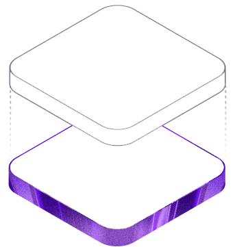
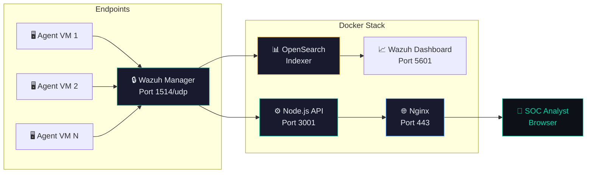

# 🛡️ SIEM Home Lab Dashboard

> A demo-friendly Security Information and Event Management (SIEM) dashboard for home labs, built with React, Node.js, Docker, and Wazuh.



<p align="center">
  
  
  
  
  
</p>

---

## 📋 Overview

A modern SOC (Security Operations Center) analyst dashboard that:

- **Ingests** security logs from Wazuh agents in real time
- **Parses** and classifies alerts by severity with MITRE ATT&CK mapping
- **Visualizes** security data with interactive charts and live feeds
- **Streams** new alerts via WebSocket for instant notification
- **Runs** entirely in Docker for easy deployment

The repository is also built to be GitHub-ready:

- A clean README with quick start and architecture context
- Demo mode that still looks strong even without a live Wazuh stack
- GitHub Actions CI for basic build validation
- Issue and pull request templates for maintainable collaboration

## 🏗️ Architecture



**Data Flow:** Agent → Wazuh Manager (1514/udp) → OpenSearch → Node.js API → Nginx (HTTPS) → React Dashboard

## ✨ Features

| Feature | Description |
|---------|-------------|
| 📊 **Dashboard** | KPI cards, area chart, donut chart, live alert feed |
| 🚨 **Alerts** | Searchable, sortable, filterable table with CSV export |
| 🖥️ **Agents** | Card grid with drill-down detail view |
| 📖 **Rules** | Frequency table with 7-day sparkline trends |
| ⚙️ **Settings** | Connection config, JWT management, notifications |
| 🔴 **Live Feed** | WebSocket-powered real-time alert streaming |
| 🎨 **Dark Theme** | SOC-optimized dark UI with severity color coding |
| 🔐 **JWT Auth** | Secure API with rate limiting and CORS |
| 🐳 **Docker** | One-command deployment with health checks |
| 📱 **Responsive** | Works on 1080p monitors and laptops |

## 📦 Prerequisites

- **Docker** & Docker Compose v2+
- **Node.js** 18+ (for local development)
- **Two VMs or WSL2** (for Wazuh Agent testing)

## 🚀 Quick Start

### 1. Clone & Configure

```bash
git clone https://github.com/<your-org-or-user>/siem-homelab.git
cd siem-homelab
cp .env.example .env
# Edit .env with your settings
```

### 2. Deploy with Docker

```bash
chmod +x scripts/setup.sh
./scripts/setup.sh
```

### 3. Access Dashboard

| URL | Service |
|-----|---------|
| `https://localhost` | SIEM Dashboard |
| `https://localhost/health` | API Health Check |
| `https://localhost:5601` | Wazuh Dashboard |

**Default Login:** `admin` / `admin123`

### Demo Mode

If Wazuh is not available yet, the frontend falls back to mock data so the dashboard still shows meaningful charts, alert feeds, and agent cards. That makes the project suitable for screenshots, walkthroughs, and GitHub demos before a full lab is online.

### Local Development (without Docker)

```bash
# Terminal 1 — API Server
cd api
cp .env.example .env
npm install
npm run dev

# Terminal 2 — Frontend
cd frontend
npm install
npm run dev
```

Dashboard runs at `http://localhost:3000` with Vite proxy to API.

## 🔌 API Reference

All endpoints (except `/health` and `/api/auth/login`) require JWT token in `Authorization: Bearer <token>` header.

| Method | Endpoint | Description | Auth |
|--------|----------|-------------|------|
| `POST` | `/api/auth/login` | Authenticate, receive JWT | ❌ |
| `GET` | `/api/alerts` | Paginated alerts (filters: `page`, `limit`, `level`, `agent_id`, `search`, `from`, `to`) | ✅ |
| `GET` | `/api/agents` | List all agents with status | ✅ |
| `GET` | `/api/agent/:id/logs` | Agent-specific logs (`limit` param) | ✅ |
| `GET` | `/api/stats` | Severity counts + histogram (`range`: 1h/6h/24h/7d) | ✅ |
| `GET` | `/api/rules` | Triggered rules by frequency | ✅ |
| `GET` | `/health` | API + Wazuh health status | ❌ |
| `WS` | `/ws/alerts` | Live alert stream (WebSocket) | ❌ |

### Example API Calls

```bash
# Login
curl -X POST http://localhost:3001/api/auth/login \
  -H "Content-Type: application/json" \
  -d '{"username":"admin","password":"admin123"}'

# Fetch alerts (with token)
curl http://localhost:3001/api/alerts?page=1&limit=10 \
  -H "Authorization: Bearer <your-jwt-token>"

# Check health
curl http://localhost:3001/health
```

## 🔐 Wazuh Setup

### Manager (Ubuntu 22.04)

```bash
# Install Wazuh Manager (official install)
curl -sO https://packages.wazuh.com/4.7/wazuh-install.sh
sudo bash wazuh-install.sh -a

# Verify
sudo /var/ossec/bin/wazuh-control status
```

### Agent (Ubuntu 22.04)

```bash
# Use the provided script
sudo ./scripts/wazuh-agent-setup.sh <MANAGER_IP>

# Or manually
curl -s https://packages.wazuh.com/key/GPG-KEY-WAZUH | gpg --import
sudo WAZUH_MANAGER="<MANAGER_IP>" apt-get install wazuh-agent
sudo systemctl enable --now wazuh-agent
```

### Verify Connectivity

```bash
# On manager
sudo /var/ossec/bin/agent_control -l

# On agent
sudo /var/ossec/bin/wazuh-control status
```

### Sample Wazuh API Call (Node.js)

```javascript
const axios = require('axios');
const https = require('https');

const client = axios.create({
  baseURL: 'https://MANAGER_IP:55000',
  httpsAgent: new https.Agent({ rejectUnauthorized: false }),
});

// Authenticate
const { data } = await client.post('/security/user/authenticate', {}, {
  auth: { username: 'wazuh-wui', password: 'your-password' }
});

// Use token
const token = data.data.token;
const alerts = await client.get('/alerts', {
  headers: { Authorization: `Bearer ${token}` },
  params: { limit: 10 }
});
```

## 📁 Project Structure

```
siem-homelab/
├── api/                        # Node.js API Server
│   ├── src/
│   │   ├── index.js           # Express + WebSocket entry
│   │   ├── config/logger.js   # Winston logger
│   │   ├── middleware/        # Auth, error, request logging
│   │   ├── routes/            # Auth, alerts, agents, stats, rules
│   │   └── services/wazuh.js  # Wazuh API client
│   ├── Dockerfile
│   └── package.json
├── frontend/                   # React SPA
│   ├── src/
│   │   ├── components/        # Sidebar, TopBar, SeverityBadge
│   │   ├── pages/             # Dashboard, Alerts, Agents, Rules, Settings
│   │   ├── hooks/             # useWebSocket
│   │   ├── services/          # API client, mock data
│   │   ├── store/             # Zustand global state
│   │   ├── App.jsx
│   │   └── index.css          # Full design system
│   └── package.json
├── nginx/
│   └── nginx.conf             # Reverse proxy + SPA config
├── wazuh/
│   └── local_rules.xml        # Custom detection rules
├── scripts/
│   ├── setup.sh               # Deploy script
│   ├── wazuh-agent-setup.sh   # Agent installer
│   └── siem-homelab.service   # systemd unit
├── docker-compose.yml
├── .env.example
├── .github/                    # GitHub Actions, templates, and repo defaults
└── README.md
```

## 🤝 Contributing

1. Fork the repository and create a feature branch.
2. Keep changes focused and update docs when behavior changes.
3. Run the frontend build and API syntax checks before opening a pull request.
4. Use the PR template so review context stays consistent.

See [CONTRIBUTING.md](./CONTRIBUTING.md) for the full workflow.

## ✅ Continuous Integration

The repository includes a GitHub Actions workflow that validates the API source syntax and builds the frontend on every push and pull request.

## 🛠️ Troubleshooting

| Problem | Fix |
|---------|-----|
| **Wazuh API 401 Unauthorized** | Check `WAZUH_USER`/`WAZUH_PASS` in `.env`. Reset Wazuh API password: `sudo /var/ossec/bin/wazuh-api-password.sh` |
| **Agent not appearing** | Verify agent config: `grep '<address>' /var/ossec/etc/ossec.conf`. Ensure port 1514/udp is open. Restart: `sudo systemctl restart wazuh-agent` |
| **Dashboard shows no data** | The app includes demo mode with mock data. For real data, verify Wazuh Manager is reachable from API server: `curl -sk https://wazuh-manager:55000` |
| **WebSocket won't connect** | Check browser console. Ensure nginx proxies `/ws/` with WebSocket upgrade headers. If behind corporate proxy, WebSocket may be blocked. |
| **Docker containers crash** | Run `docker-compose logs <service>`. OpenSearch needs `vm.max_map_count=262144` — run: `sudo sysctl -w vm.max_map_count=262144` |
| **SSL certificate error** | Expected for self-signed certs. Accept in browser or generate Let's Encrypt cert: `certbot certonly --standalone -d yourdomain.com` |
| **Port conflicts** | Change ports in `docker-compose.yml`. Default: 80, 443 (nginx), 5601 (Wazuh Dashboard), 55000 (Wazuh API), 1514 (Agent) |

## 🔥 Firewall Rules

```bash
# Allow HTTPS
sudo ufw allow 443/tcp

# Allow HTTP (redirects to HTTPS)
sudo ufw allow 80/tcp

# Allow Wazuh agent communication
sudo ufw allow 1514/udp
sudo ufw allow 1515/tcp

# Enable firewall
sudo ufw enable
sudo ufw default deny incoming
```

## ✅ Post-Deploy Checklist

1. ☐ Agents appear in the Agents page with "active" status
2. ☐ Alerts flow into the Dashboard live feed
3. ☐ KPI cards show non-zero values
4. ☐ Area chart renders alert volume over time
5. ☐ Severity donut chart shows distribution
6. ☐ JWT auth works — login/logout cycle
7. ☐ WebSocket live feed shows connection status as "Live"
8. ☐ Critical alert triggers browser notification (if enabled)

## 📜 License

MIT License — see [LICENSE](LICENSE) for details.

---

<p align="center">
  Built with ❤️ for SOC analysts and security enthusiasts
</p>
